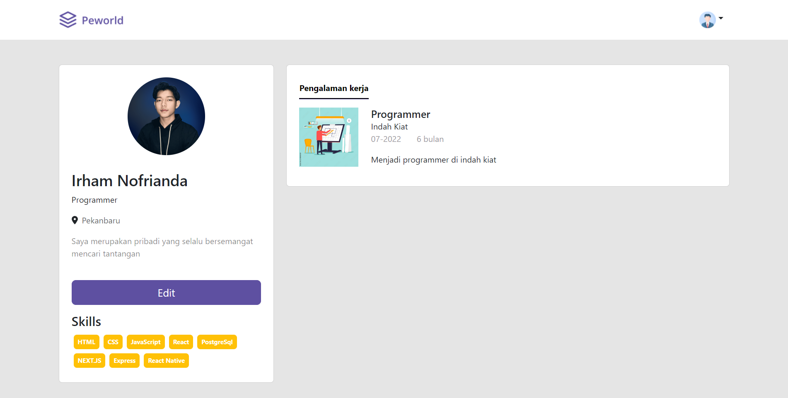

# Hire Job Portfolio  📝👔🔍

## Project Description 🚀

Hire Job offers a range of features designed to facilitate job search and recruitment. With a user-friendly interface, job seekers can easily search and explore available job opportunities. The platform aims to connect job seekers with potential employers, streamlining the job application process.

## Technologies Used 💻🛠️

The Hire Job project is built using the following technologies:

- HTML
- CSS
- JavaScript
- Bootstrap
- SASS (Syntactically Awesome Style Sheets)
- JQuery
- NEXT.JS (React framework)
- Google Analytics (Web analytics service)
- Error Analytics (Error tracking and monitoring)

## Project Repository 📂🔗

The backend repository for this project can be found on GitHub at the following link:
[Hire Job Backend Repository](https://github.com/IrhamNfrnda/hire_job_be)

## Features ✨🔍

- User-friendly job search and exploration
- Job application management
- Employer job posting and management
- Candidate profile creation and editing
- Job alerts and notifications
- Seamless user experience with NEXT.JS
- Monitoring and analysis of website traffic with Google Analytics
- Tracking and resolving errors with Error Analytics

## Screenshots 📸

<table>
   <tr>
    <td>Home Page/></td>
    <td>Profile Page</td>
  </tr>
   <tr>
    <td></td>
    <td> </td>
  </tr>
   <tr>
    <td>Login Page/></td>
    <td>Register Page</td>
  </tr>
   <tr>
    <td></td>
    <td> </td>
  </tr>
   <tr>
    <td>Jobs List Page/></td>
    <td></td>
  </tr>
   <tr>
    <td></td>
    <td></td>
  </tr>
</table>

## Getting Started 🏁🚀

To set up the Hire Job project locally, follow these steps:

1. Clone the backend repository from the provided link.
2. Install the required dependencies using npm.
3. Set up your database and update the configuration accordingly.
4. Ensure you have Node.js and npm installed on your system.
5. Start the development server using the command `npm run dev`.
6. Access the project through your preferred web browser.

## Contributions 🤝🌟

Contributions to the Hire Job project are welcome. If you find any issues or have suggestions for improvements, please feel free to open an issue or create a pull request in the backend repository.

## License 📜📝

This project is licensed under the MIT License - see the [LICENSE](LICENSE) file for details.

## Contact 📞📧

If you have any questions or inquiries regarding this project, feel free to contact me at [irhamnfrnda@gmail.com](mailto:irhamnfrnda@gmail.com).

---

Thank you for exploring my Hire Job portfolio. I hope this project showcases my skills and enthusiasm for creating innovative solutions in the job recruitment industry.
